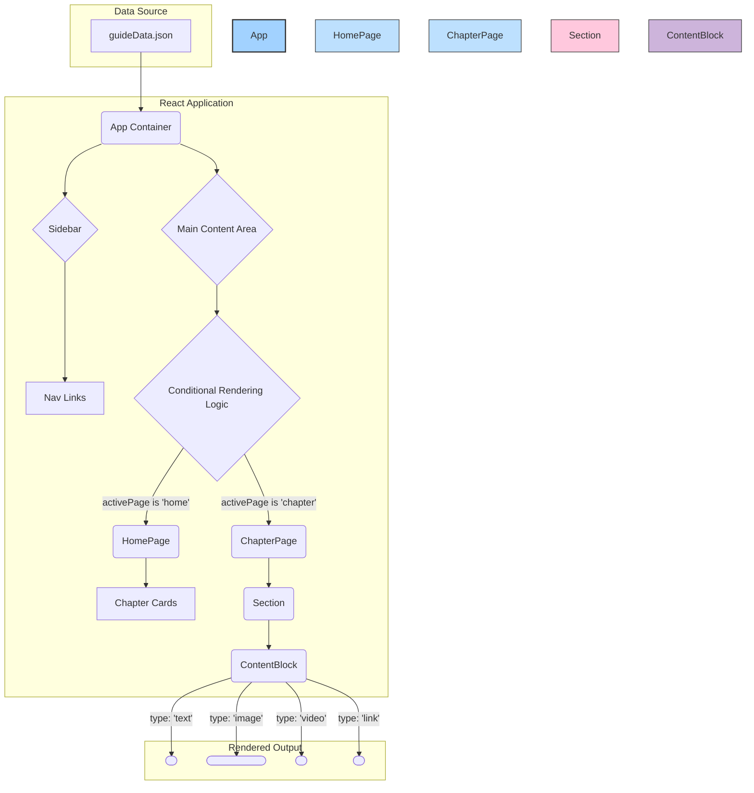

# Technical Specification: React Interactive Guide Application

**Version:** 1.0  
**Date:** September 25, 2025  
**Author:** Software Architect

## 1. Overview

This document outlines the technical architecture for a data-driven, interactive guide application built with React. The primary design principle is a "Data-Driven UI," where the entire user interface is dynamically rendered based on a single, structured JSON object (guideData.json). This approach ensures a clean separation of concerns, simplifies state management, and enhances maintainability.

The architecture is component-based, modular, and follows standard React best practices, including unidirectional data flow and a clear distinction between container and presentational components. Styling will be implemented using Tailwind CSS, as per the provided design prototype.

## 2. Core Architectural Principles

**Single Source of Truth (SSOT):** The App component will hold the entire application state, derived from the guideData.json object. All data flows downwards to child components via props.

**Unidirectional Data Flow:** State changes are managed at the top level and propagated down. Child components communicate intentions to modify the state via callback functions passed as props (e.g., onNavigate).

**Component Modularity & Reusability:** Components are designed with specific, narrowly-defined responsibilities. The ContentBlock component, in particular, is designed as a polymorphic renderer to be highly reusable for any content type.

**Separation of Concerns:** Container components (e.g., App) are responsible for state and logic, while presentational components (e.g., ContentBlock) are responsible for rendering the UI based on the props they receive.

## 3. Component Architecture

### 3.1. Architecture Diagram

The following diagram illustrates the component hierarchy and the flow of data from the JSON source to the rendered UI elements.

### 3.2. Component Specification

#### 3.2.1. App.jsx

**Type:** Root Container Component

**Responsibilities:**
- Serves as the application's root
- Holds and manages the entire application state (guideData, activePage)
- Implements top-level routing logic to conditionally render HomePage or ChapterPage
- Renders the main layout structure, including the Sidebar and the primary content area

**State:**
- `guideData`: (Object) The comprehensive guide content, loaded from the JSON source
- `activePage`: (Object) Determines the view in the main content area. Shape: `{ type: 'home' | 'chapter', id: string | null }`

**Props API:** None

#### 3.2.2. Sidebar.jsx

**Type:** Presentational Component

**Responsibilities:**
- Displays the main navigation menu
- Renders a static link to the home page
- Iterates over the chapters array to render a dynamic list of navigation links
- Highlights the currently active navigation link

**Props API:**
- `chapters`: (Array) List of chapter objects from the guide data
- `onNavigate`: (Function) Callback to update activePage state in the App component
- `activePageId`: (String) The ID of the currently active page/chapter for styling purposes

#### 3.2.3. HomePage.jsx

**Type:** Presentational Component

**Responsibilities:**
- Renders the main welcome title and introductory content
- Renders a grid of clickable "Chapter Cards," providing a summary of each chapter
- Invokes the onNavigate callback upon a card click to transition to a specific chapter view

**Props API:**
- `homePageData`: (Object) Contains the title and content for the home page
- `chapters`: (Array) List of all chapter objects
- `onNavigate`: (Function) Callback to update activePage state in the App component

#### 3.2.4. ChapterPage.jsx

**Type:** Presentational Component

**Responsibilities:**
- Displays the title and detailed content for a single chapter
- Iterates over the sections array of the chapter and renders a Section component for each item

**Props API:**
- `chapter`: (Object) The full data object for the chapter to be displayed

#### 3.2.5. Section.jsx

**Type:** Stateful Presentational Component

**Responsibilities:**
- Renders a single content section within an accordion-style UI
- Manages its own UI state (isOpen) to toggle the visibility of its content
- Displays the section title and introductory content
- Iterates over the contentBlocks array and renders a ContentBlock component for each item

**State:**
- `isOpen`: (Boolean) Controls the collapsed/expanded state of the accordion

**Props API:**
- `section`: (Object) The data for the specific section

#### 3.2.6. ContentBlock.jsx

**Type:** Presentational Component

**Responsibilities:**
- Acts as a polymorphic component responsible for rendering different types of content blocks
- Uses a switch statement on its block.type prop to determine the appropriate HTML element to render (p, figure, iframe, etc.)
- This is a "dumb" component focused solely on presentation based on its props

**Props API:**
- `block`: (Object) A content block object, containing type and a data payload

## 4. Scalability and Maintenance

This architecture is designed for scalability. To introduce a new content type (e.g., a "quote" or "code snippet"), a developer only needs to:

1. Define the new type and its data schema in the JSON structure
2. Add a corresponding case to the switch statement within the ContentBlock.jsx component

No other components require modification, minimizing development overhead and the risk of regressions. The unidirectional data flow ensures that application state remains predictable and easier to debug as complexity grows.